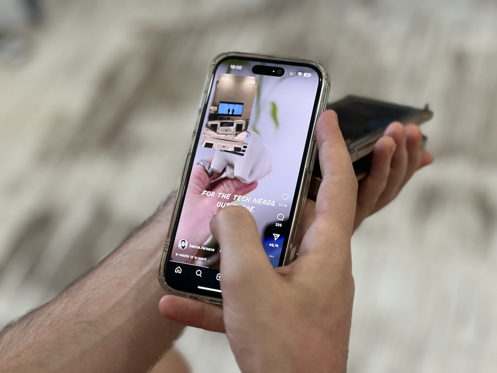

# eyePhone

An example project for [Demystifying Picture in Picture on iOS](https://www.artemnovichkov.com/blog/demystifying-picture-in-picture-on-ios) article.

  

## Author

Artem Novichkov, https://www.artemnovichkov.com/

## License

The project is available under the MIT license. See the [LICENSE](./LICENSE) file for more info.